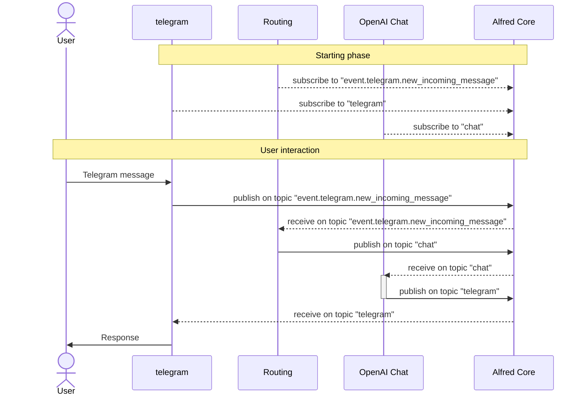
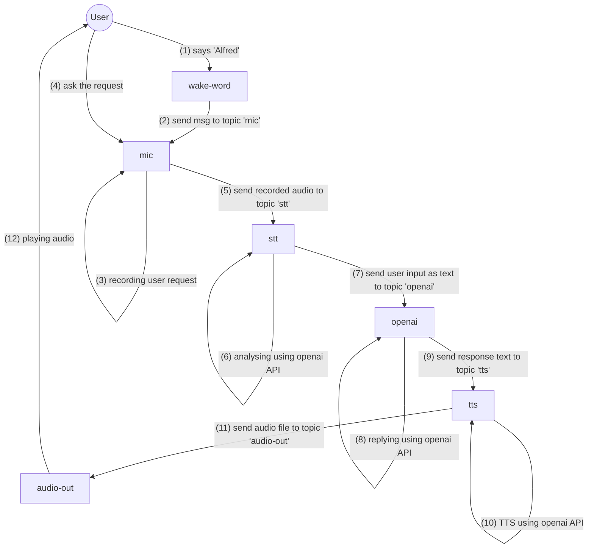

# Alfred
**DISCLAIMER: This documentation is a work-in-progress.**

**Alfred** is the simplest way to create your own AI agent with a modular structure!

## Docs
 - More tech-ish info [HERE](docs/details.md).
 - If you want to create a new module using this library, check [HERE](docs/new_module.md).

<!--
Alfred is a free framework able to manage multi-channel user interactions with AI and other services.
The main idea behind Alfred is to allow users to add features easily, like installing applications on a device.

The core of the framwork is written in Rust, but each applications (named "modules") can be written in different languages.

Each module does a specific job: there is a module which receives and sends messages using Telegram, there is a module which interact with OpenAI, another module interacts with HomeAssistant and so on. The modules exchange messages using a PUB/SUB architecture (implemented with [ZeroMQ](https://zeromq.org/)). This system allows to be technology-independent: for example, you can use the SpeechToText by OpenAI or choosing the one from Google, running the proper module without changing anything.
-->

## Installation
If you need to install Alfred as typical user (no code changes needed), you have to follow this section.
Instead, if you need to work on a specific module (or to help us to improve this library), follow [this document](docs/dev_installation.md).

### Prerequisites:
 - curl
 - tar

**IMPORTANT: if you already have a running installation, back-up the configuration files before running the following commands!**

```shell
curl --proto '=https' --tlsv1.2 -sSf https://github.com/PaoloPana/alfred-rs/raw/refs/heads/main/scripts/install-alfred.sh | sudo sh
```

## Official modules
### AI Callback
https://github.com/PaoloPana/alfred-ai-callback
### Audio out
https://github.com/PaoloPana/alfred-audio-out
### Console
https://github.com/PaoloPana/alfred-console
### Home Assistant
https://github.com/PaoloPana/alfred-homeassistant
### IDroid01
https://github.com/PaoloPana/alfred-idroid01
### LedMatrix
https://github.com/PaoloPana/alfred-ledmatrix
### Mic
https://github.com/PaoloPana/alfred-mic
### OpenAI
https://github.com/PaoloPana/alfred-openai
### Telegram
https://github.com/PaoloPana/alfred-telegram
### Wake-word
https://github.com/PaoloPana/alfred-wake-word


## Examples
### Telegram ChatBot
The best way to explain this idea is with an example: there is the core daemon (LINK TO DAEMON) which creates the base connections between modules. Let's suppose to create a simple chat bot which replies to text questions. In this case, we will execute the following modules:
 - telegram (to receive and send message using telegram bot API)
 - openai-chat (which receives a request and send a response using OpenAI ChatGPT system)
To connect these modules, we have 2 options:
 - (simpler way) configuring the routing.yml file to map the telegram event "received a message" to the openai-chat input topic,
 - creating a custom module which does the routing manually.
For this example, we can configure the routing.yml to get the incoming message from telegram and send to openai-chat module:
```toml
[[routing]]
from_topic = "event.telegram.new_incoming_message"
to_topic = "chat"
```



### Personal voice assistant


## ToDo
 - Documentation:
   - Improve examples section
   - Improve list of official modules
   - Improve core details
   - Improve dev_installation
   - Write new_module tutorial
 - Cron:
   - Manage empty file
 - Routing:
   - Manage empty file